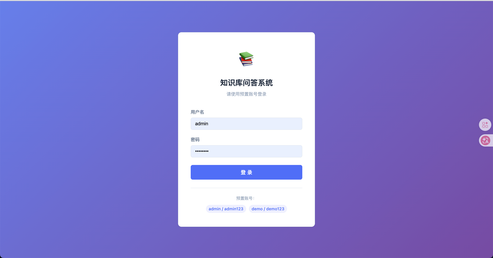
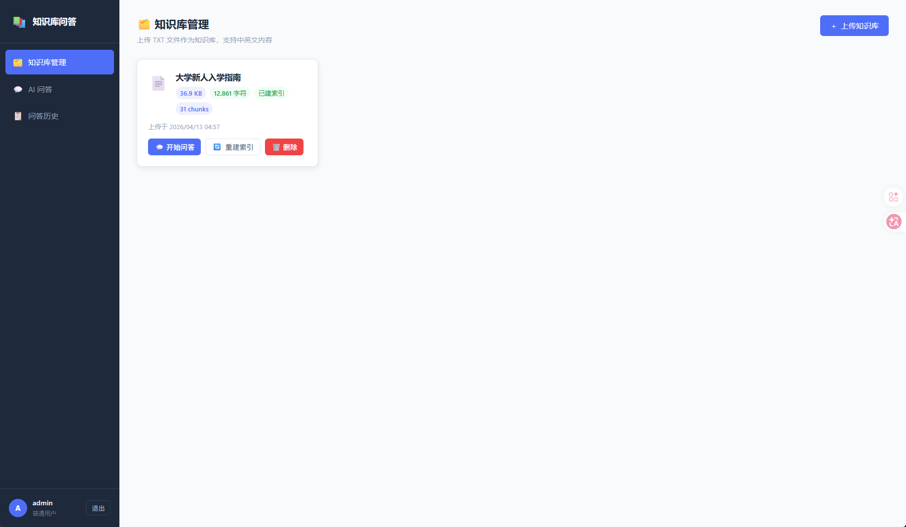
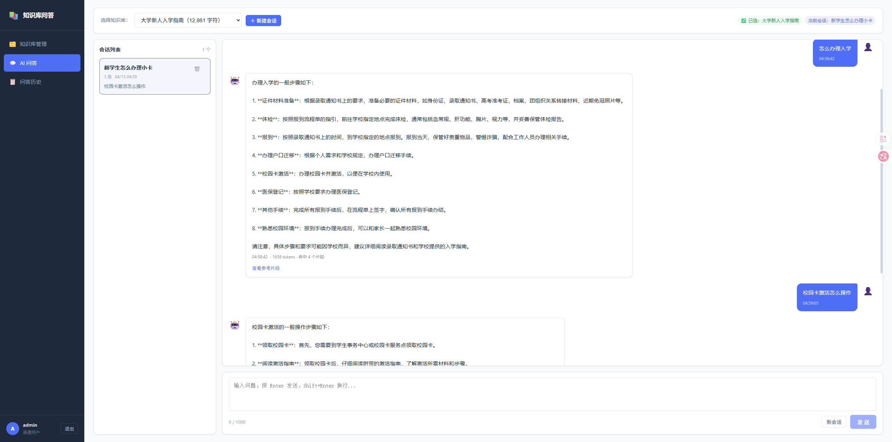
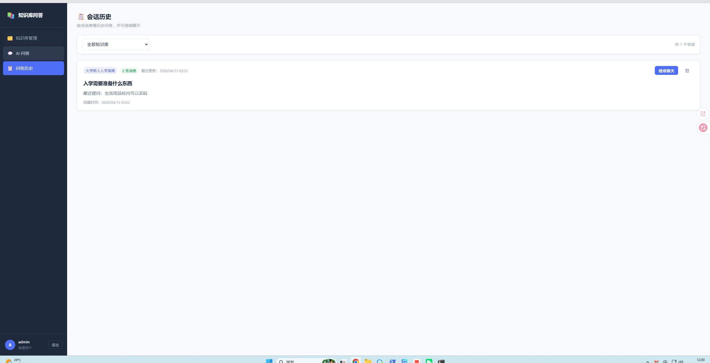

# 知识库问答系统
  
一个基于 **Vue 3 + Flask + SQLite + 智谱 AI** 的轻量级知识库问答项目。

你可以上传 `.txt` 文件作为知识库，系统会基于知识库内容进行问答，并支持：

- 多轮连续追问
- 真正会话式聊天
- 历史会话恢复
- 按知识库管理会话
- 基于 **ChromaDB + Embedding** 的 RAG 检索增强

适合课程设计、毕业设计、内部工具原型或个人练手项目。

---

## 功能特性

### 1. 用户认证
- 预置账号登录，无需注册
- 使用 JWT 进行接口鉴权
- 前端自动注入 Token，请求 401 自动跳转登录页

### 2. 知识库管理
- 支持上传 `.txt` 文件作为知识库
- 支持删除知识库
- 展示文件大小、字符数、上传时间
- 删除知识库时会联动删除关联会话和问答记录

### 3. AI 知识库问答
- 基于智谱 AI 大模型生成回答
- 使用 **RAG（检索增强生成）** 方案，不再直接整篇喂给模型
- 上传知识库后自动切分文本并写入 ChromaDB 向量库
- 提问时先做向量检索，再将 Top-K 相关片段交给模型生成答案
- 回答受知识片段约束，减少幻觉
- 支持多轮上下文，能够继续追问
- 支持在同一知识库下创建多个独立会话

### 4. 会话式聊天
- 自动创建新会话
- 支持手动新建会话
- 左侧展示当前知识库下的会话列表
- 点击历史会话可恢复聊天内容
- 刷新页面后仍可继续聊天

### 5. 历史会话管理
- 历史页按“会话”展示，而不是零散单条问答
- 支持按知识库筛选会话
- 支持从历史页一键“继续聊天”
- 支持删除整段会话

---
## 🖼️ 页面截图

### 登录页


### 知识库管理


### AI 问答


### 问答历史

## 技术栈

| 层级 | 技术 |
|---|---|
| 前端 | Vue 3、Vite、Pinia、Vue Router、Axios |
| 后端 | Python、Flask、Flask-CORS、Flask-SQLAlchemy、Flask-JWT-Extended |
| 数据库 | SQLite |
| 向量数据库 | ChromaDB |
| AI | 智谱 AI（默认 `glm-4-flash`，Embedding 默认 `embedding-3`） |

---

## 项目结构

```text
.
├── README.md
├── kb-qa-backend/
│   ├── app.py                # Flask 主应用、接口、数据库初始化
│   ├── ai_service.py         # AI 生成服务，基于检索片段回答
│   ├── rag_service.py        # RAG 服务：切分、向量化、入库、检索
│   ├── models.py             # 数据模型：User / KnowledgeBase / ChatSession / ChatHistory
│   ├── requirements.txt      # 后端依赖
│   ├── uploads/              # 上传的知识库文件目录
│   └── .env.example          # 环境变量示例（请自行复制为 .env）
├── kb-qa-frontend/
│   ├── package.json
│   ├── vite.config.js
│   ├── index.html
│   └── src/
│       ├── main.js
│       ├── App.vue
│       ├── style.css
│       ├── api/
│       │   ├── request.js    # Axios 封装
│       │   ├── auth.js
│       │   ├── kb.js
│       │   └── chat.js
│       ├── router/
│       │   └── index.js
│       ├── stores/
│       │   ├── auth.js
│       │   └── toast.js
│       └── views/
│           ├── LoginView.vue
│           ├── LayoutView.vue
│           ├── KbView.vue
│           ├── ChatView.vue
│           └── HistoryView.vue
└── kb-qa-project/
    ├── images/               # 页面截图
    └── 知识库/               # 示例知识库文件
```

---

## 运行环境

建议环境：

- Python 3.11+
- Node.js 18+
- npm 9+
- 智谱 AI API Key

---

## 快速开始

### 一、启动后端

进入后端目录：

- 目录：`kb-qa-backend`

建议步骤：

1. 创建虚拟环境
2. 安装依赖
3. 创建 `.env`
4. 启动 Flask 服务

后端依赖见：

- `flask==3.0.3`
- `flask-cors==4.0.1`
- `flask-sqlalchemy==3.1.1`
- `flask-jwt-extended==4.6.0`
- `werkzeug==3.0.3`
- `zhipuai>=2.1.5`
- `chromadb>=0.5.5`
- `python-dotenv==1.0.1`
- `sniffio>=1.3.0`

你需要在 `kb-qa-backend` 下自行创建 `.env` 文件，常用配置如下：

```env
JWT_SECRET_KEY=your-secret-key
ZHIPUAI_API_KEY=your-api-key-here
ZHIPUAI_MODEL=glm-4-flash
ZHIPUAI_EMBEDDING_MODEL=embedding-3
UPLOAD_FOLDER=uploads
CHROMA_PERSIST_DIR=chroma_db
CHROMA_COLLECTION_NAME=kb_qa_chunks
RAG_CHUNK_SIZE=500
RAG_CHUNK_OVERLAP=80
RAG_TOP_K=4
RAG_EMBED_BATCH_SIZE=32
```

说明：

- `ZHIPUAI_API_KEY` 必填
- `ZHIPUAI_MODEL` 默认推荐 `glm-4-flash`
- `ZHIPUAI_EMBEDDING_MODEL` 默认推荐 `embedding-3`
- `CHROMA_PERSIST_DIR` 为 Chroma 向量库本地持久化目录
- `RAG_CHUNK_SIZE` / `RAG_CHUNK_OVERLAP` 控制文本切片策略
- `RAG_TOP_K` 控制每次检索召回的片段数量
- `UPLOAD_FOLDER` 默认可使用 `uploads`

启动后端后，默认运行地址：

- `http://localhost:5001`

---

### 二、启动前端

进入前端目录：

- 目录：`kb-qa-frontend`

执行：

1. 安装依赖
2. 启动开发服务器

前端默认地址：

- `http://localhost:5173`

---

### 三、默认账号

系统会自动初始化两个测试账号：

| 用户名 | 密码 |
|---|---|
| admin | admin123 |
| demo | demo123 |

---

## 使用说明

### 1. 上传知识库
进入“知识库管理”页面，上传 `.txt` 文件。

### 2. 开始问答
进入“AI 问答”页面：

- 先选择知识库
- 发送第一条问题后，系统会自动创建一个会话
- 后续追问会自动沿用当前会话上下文

### 3. 新建会话
如果你想基于同一个知识库讨论不同主题，可以点击：

- `新建会话`

这样每个主题都会成为独立会话，不会互相干扰。

### 4. 恢复历史会话
进入“会话历史”页后，可以：

- 查看某个知识库下的全部会话
- 点击“继续聊天”恢复某个历史会话

---

## 接口概览

所有接口统一以 `/api` 为前缀。

需要鉴权的接口，请在请求头中携带：

`Authorization: Bearer <token>`

### 认证接口

| 方法 | 路径 | 说明 |
|---|---|---|
| POST | `/api/auth/login` | 登录 |
| GET | `/api/auth/me` | 获取当前用户信息 |

### 知识库接口

| 方法 | 路径 | 说明 |
|---|---|---|
| GET | `/api/kb` | 获取知识库列表 |
| POST | `/api/kb/upload` | 上传知识库 TXT 文件 |
| DELETE | `/api/kb/<id>` | 删除知识库 |
| POST | `/api/kb/<id>/reindex` | 重建指定知识库的向量索引 |

### 会话接口

| 方法 | 路径 | 说明 |
|---|---|---|
| GET | `/api/chat/sessions` | 获取会话列表 |
| POST | `/api/chat/sessions` | 创建会话 |
| GET | `/api/chat/sessions/<session_id>` | 获取会话详情及消息列表 |
| DELETE | `/api/chat/sessions/<session_id>` | 删除整个会话 |

### 问答接口

| 方法 | 路径 | 说明 |
|---|---|---|
| POST | `/api/chat` | 发起问答，支持 `session_id` 持续会话 |
| GET | `/api/chat/history` | 获取问答历史，可按 `kb_id`、`session_id` 筛选 |
| DELETE | `/api/chat/history/<history_id>` | 删除单条问答记录 |

### 健康检查

| 方法 | 路径 | 说明 |
|---|---|---|
| GET | `/api/health` | 服务健康检查 |

---

## 关键数据模型

### User
用户表，保存预置登录账号。

### KnowledgeBase
知识库表，保存上传的 `.txt` 文件信息。

### ChatSession
会话表，表示一个独立聊天主题。

### ChatHistory
问答历史表，每一轮问答都归属于某个会话。

---

## AI 与 RAG 说明

本项目当前已升级为 **RAG（Retrieval-Augmented Generation，检索增强生成）** 方案。

完整流程如下：

1. 上传 TXT 知识库
2. 后端对文本进行清洗与切分
3. 调用智谱 Embedding 模型生成向量
4. 将文本片段写入 ChromaDB 向量库
5. 用户提问时，先将问题向量化
6. 在 ChromaDB 中检索最相关的 Top-K 片段
7. 将检索结果 + 会话历史一并交给大模型生成答案

当前实现特点：

- 比原来的“整篇文本直接注入”更适合中大型知识库
- 能显著降低上下文浪费
- 更适合后续扩展 PDF / Markdown / 多文档知识库
- 已兼容会话式多轮追问

当前默认方案：

- 向量数据库：ChromaDB
- Embedding 模型：智谱 `embedding-3`
- 对话模型：智谱 `glm-4-flash`

后续还可以继续扩展为：

- FAISS 本地索引方案
- 混合检索（关键词 + 向量）
- 重排（Rerank）
- 多路召回
- 文档来源高亮

---

## 页面说明

当前主要页面：

- 登录页
- 知识库管理页
- AI 问答页
- 会话历史页

项目中已有截图资源，位于：

- `kb-qa-project/images/`

> 注意：由于项目近期已经升级为“会话式聊天”，如果截图仍是旧版页面，可重新截图后替换。

---

## 开发说明

### 数据库说明
项目默认使用 SQLite，数据库文件位于后端目录下自动生成。

当前已做兼容处理：

- 首次启动自动建表
- 对旧版数据库自动补齐 `chat_sessions` 表和 `session_id` 字段

### 适合继续扩展的方向
你可以在当前基础上继续扩展：

- 会话重命名
- AI 自动生成会话标题
- 单条消息重试 / 重新回答
- Markdown 渲染
- 文件分段检索
- 向量数据库接入
- 用户注册与权限管理

---

## 常见问题

### 1. 为什么 AI 说“知识库中未找到相关信息”？
因为当前 Prompt 被限制为：

- 尽量只根据知识库内容回答
- 不允许随意编造知识库外信息

这属于预期行为。

### 2. 为什么超长知识库效果会波动？
虽然当前已经接入 RAG，但效果仍受以下因素影响：

- 切片大小是否合适
- Embedding 模型质量
- Top-K 召回数量是否合理
- 原始 TXT 内容结构是否清晰

如果知识库很大，建议进一步加入 rerank、标题分块、语义分段等优化。

### 3. 刷新页面后还能继续问吗？
可以。

因为现在已经改造成会话式聊天，历史消息保存在数据库中，刷新后可恢复会话继续提问。

---

## 部署建议

开发环境下可直接前后端分开运行。

生产部署建议：

- 前端：`npm run build` 后部署静态资源
- 后端：使用 Gunicorn / Waitress / Nginx 反向代理
- 数据库：生产环境建议替换为 MySQL 或 PostgreSQL

如果你部署到 Linux 服务器，推荐：

- Nginx 托管前端静态资源
- Gunicorn 启动 Flask
- `/api` 反向代理到 Flask 服务

---

## 注意事项

- `.env` 包含敏感信息，不要提交到仓库
- `uploads/` 中是用户上传的知识库文件，注意备份和权限控制
- SQLite 适合开发和轻量项目，不适合高并发生产场景
- 当前 Token 默认不过期，如用于生产请自行补充过期时间和刷新机制

---

## License

MIT
