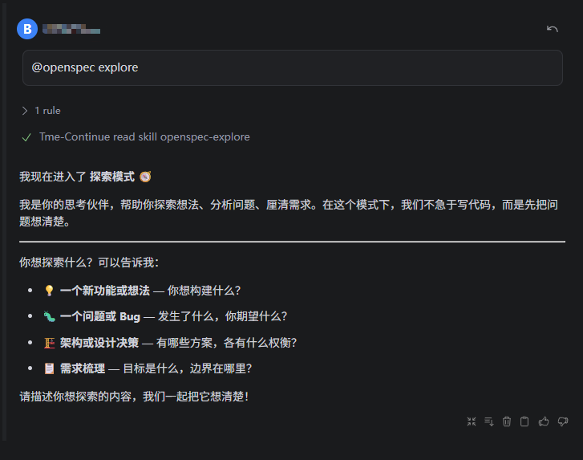
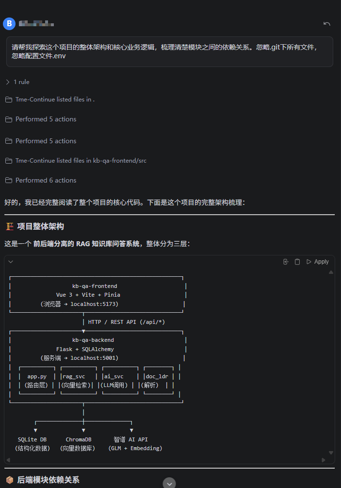
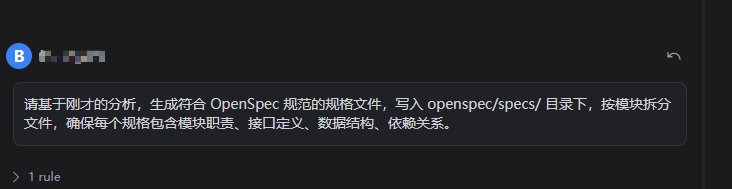
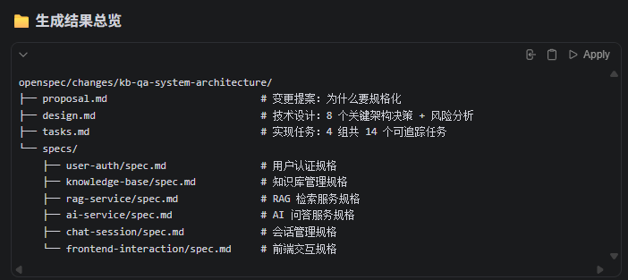
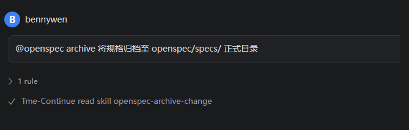
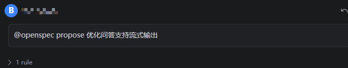
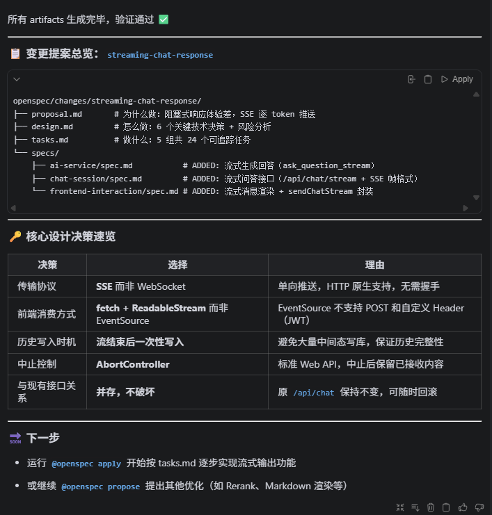
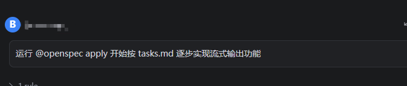

# 用 OpenSpec 规范驱动开发：从需求到上线的完整实践

> 本文通过一个真实的知识库问答系统项目，展示如何使用 OpenSpec 框架进行规范驱动开发。从需求分析、架构设计、代码实现到验证部署，完整演示了一套工程化的开发流程。

---

## 第一部分：引入与背景

### 传统开发的痛点：从「古法编程」到「规范驱动」

在 AI 应用爆炸式增长的时代，我们看到了一个现象：**很多团队仍在用「古法编程」的方式开发 AI 功能**。

#### 古法编程的典型症状

**场景 1：需求理解的「各自为政」**

```
产品经理："我们需要流式输出，让用户看到 AI 逐字生成的回答"
后端开发："好的，我用 SSE 实现"
前端开发："等等，我理解的是 WebSocket？"
测试人员："那验收标准是什么？延迟多少算合格？"
```

结果：三周后，后端和前端的实现完全不兼容，需要推倒重来。

**场景 2：代码与设计的「渐行渐远」**

```
设计文档说："流式输出时，每个 token 单独推送"
实现代码："为了性能，我改成了每 10 个 token 批量推送"
三个月后：新人维护代码，看着设计文档一脸懵，"为什么代码和文档不一样？"
```

**场景 3：AI 大白话编程的「技术债爆炸」**

```
开发者 A："用 Claude 生成了一个 SSE 流式接口"
开发者 B："用 ChatGPT 生成了一个 WebSocket 接口"
开发者 C："用 Copilot 生成了一个长轮询接口"

三个月后：代码库里有三套实现，没人知道哪个是标准的。
```

**场景 4：多轮迭代中的「需求蔓延」**

```
第一版："实现流式输出"
第二版："加上停止生成按钮"
第三版："支持多轮对话"
第四版："支持并发请求"
第五版："支持流式输出中的错误恢复"

每一版都改动核心逻辑，最后没人敢动这段代码。
```

#### 为什么 AI 应用开发特别容易陷入这个坑？

1. **AI 功能的复杂性**：涉及后端 AI 服务、前端交互、数据库设计、向量检索等多个模块，任何一个环节的理解偏差都会导致整个功能失败

2. **AI 大模型的「黑盒性」**：开发者往往依赖 AI 生成代码，但对生成的代码缺乏深入理解，导致代码质量参差不齐

3. **快速迭代的压力**：为了赶上 AI 应用的风口，团队往往跳过设计阶段，直接开始编码，结果是技术债不断累积

4. **跨模块协作的困难**：后端、前端、数据库、AI 服务等多个团队需要协作，但缺乏统一的规范，导致沟通成本极高

#### 古法编程的代价

- 💸 **时间成本**：需求不清导致返工，代码与设计不一致导致维护困难
- 🐛 **质量问题**：缺乏清晰的验收标准，导致 Bug 频繁出现在生产环境
- 👥 **人力成本**：新人上手困难，需要花费大量时间理解代码逻辑
- 📉 **技术债**：快速堆砌的代码，最后变成了难以维护的「遗留系统"

### OpenSpec 是什么？

**OpenSpec** 是一个规范驱动开发框架，它提供了一套完整的工作流来解决上述问题：

```
Propose（提案）→ Design（设计）→ Specs（规格）→ Tasks（任务）→ Apply（实现）→ Archive（归档）
```

与传统的 Agile/Scrum 不同，OpenSpec 强调：

- ✅ **规格优先**：在写代码前，先用规格明确"做什么"和"怎么验证"
- ✅ **设计决策文档化**：记录"为什么这样做"，便于后续维护和迭代
- ✅ **可追踪的任务**：每个任务都对应规格中的具体需求，实现与规格一一对应
- ✅ **自动化工作流**：从提案到归档，整个过程可以自动化管理

### 项目背景

我们的项目是一个**知识库问答系统**，基于 Vue 3 + Flask + ChromaDB + 智谱 AI 构建。核心功能是：

1. 用户上传知识库文件（PDF、Word、Markdown 等）
2. 系统自动切分文本、向量化、存入 ChromaDB
3. 用户提问时，系统检索相关片段，交给大模型生成回答
4. 支持多轮对话和会话管理

**问题**：原有的问答接口是阻塞式的，用户需要等待 3-8 秒才能看到回答，体验不佳。

**目标**：实现流式输出，让用户实时看到 AI 逐字生成的回答，显著提升交互体验。

这个需求涉及后端（生成器函数、SSE 接口）、前端（流式消费、UI 渲染）、数据库（事务管理）等多个方面，是一个典型的跨模块功能。我们决定用 OpenSpec 来规范这个开发过程。

---

## 第二部分：先做存量项目摸底，再进入规格设计

这一步其实是本项目最真实、也最容易被忽略的一步：**这个项目一开始并没有采用 OpenSpec**。

也就是说，我们不是在一张白纸上做 Proposal、Design 和 Specs，而是面对一个已经跑起来、已经有前后端代码、已经有知识库问答流程的存量项目。要把 OpenSpec 引入这样的项目，第一件事不是直接写新需求提案，而是：

1. **先扫描现有项目文件**，理解系统边界与模块职责
2. **把已有能力整理成规格基线**，补齐系统的“说明书”
3. **在已有规格基线之上**，再为流式输出这个新需求做 Proposal、Design 和 Specs


### 2.1 存量项目摸底：先理解系统，再谈变更

在没有 OpenSpec 的老项目里，最大的风险不是“不会写代码”，而是**你以为自己理解了系统，其实并没有**。

因此我们没有一上来就写 `POST /api/chat/stream`，而是先让 AI 帮我们扫描项目文件、梳理现有架构、识别模块边界，并把这些信息沉淀为后续可复用的规格基线。

#### 与 AI 一起扫描现有项目








#### 在基线之上，再提出新需求

完成存量系统的规格基线之后，项目才正式进入这次新需求的 OpenSpec 工作流。这里的逻辑不是“从零开始做一个新系统”，而是：**在已经归档的 capability 基线上，对流式输出发起一次可追踪的增量变更**。

从这里开始，后续过程严格按照 OpenSpec 的标准链路推进：

```
Propose（提案）→ Design（设计）→ Specs（规格）→ Tasks（任务）→ Apply（实现）→ Archive（归档）
```

### 2.2 Propose 阶段：正式提出流式输出变更

**Proposal（提案）** 的作用，是在已有系统基线之上回答三个问题：

1. **Why**：为什么要做这个功能？
2. **What**：具体要做什么？
3. **Capabilities**：涉及哪些模块的变更？

#### 与 AI 一起提出新需求提案



**【截图 #6 说明】**

**对话主题**：在已有规格基线之上，提出“流式输出”这个新需求

**关键要点**：
- 这不是从零开始定义系统，而是在既有 knowledge base、chat-session、ai-service 等能力之上提出变更
- 明确了新需求的业务价值：降低等待感、提升交互反馈速度
- 初步锁定了会受影响的模块范围，为后续设计和规格修改建立边界

**对项目的影响**：
有了这一步，后续所有讨论都不再是“要不要做流式输出”，而是围绕“这次变更具体改哪些 capability、怎么验收”展开。





基于前面的项目扫描与架构梳理，我们生成了如下的 Proposal：

```markdown
## Why

当前问答接口采用阻塞式响应：后端等待大模型生成完整回答后才一次性返回，
用户面对长回答时需等待数秒才能看到任何内容，体验较差。
引入流式输出（SSE）后，模型每生成一个 token 即推送至前端，
用户可实时看到回答逐字出现，显著提升交互流畅感。

## What Changes

- 新增后端流式问答接口 `POST /api/chat/stream`，基于 Server-Sent Events（SSE）逐 token 推送模型输出
- 新增 `ai_service.py` 中的流式调用函数 `ask_question_stream()`，使用 ZhipuAI SDK 的 `stream=True` 模式
- 修改 `ai-service` 规格：新增"流式生成回答"requirement
- 修改 `chat-session` 规格：新增"流式问答历史写入"requirement
- 修改 `frontend-interaction` 规格：新增"流式消息渲染"requirement
- 原有 `POST /api/chat` 非流式接口保持不变，两者并存

## Capabilities

### Modified Capabilities

- `ai-service`：新增流式生成回答的 requirement
- `chat-session`：新增流式问答场景下的历史写入 requirement
- `frontend-interaction`：新增流式消息渲染 requirement
```

### 2.3 Design 阶段：技术方案决策

**Design（设计）** 阶段的核心是做出技术决策，并记录"为什么这样做"。

#### 技术方案对比

我们需要在三种方案中选择：

| 方案 | 优点 | 缺点 | 适用场景 |
|---|---|---|---|
| **SSE** | 简单、HTTP 原生、无需额外依赖 | 单向推送、不支持 POST | 服务端推送数据 |
| **WebSocket** | 双向通信、低延迟 | 复杂、需要额外库、连接管理复杂 | 实时双向通信 |
| **长轮询** | 兼容性好 | 效率低、服务器压力大、延迟高 | 不推荐 |

对于我们的场景，**SSE 是最优选择**，因为：

1. ✅ 我们只需要单向推送（服务端 → 客户端）
2. ✅ HTTP 原生支持，无需额外依赖
3. ✅ 实现简单，维护成本低
4. ✅ 浏览器原生支持 EventSource API（虽然我们用 fetch）

#### Design 阶段关注什么？

Proposal 确认之后，我们开始进入真正的技术设计阶段。这个阶段关注的不是“要不要做”，而是：

- 选择什么通信方案最合适
- 新接口如何与旧接口并存
- 历史消息在什么时机写库最安全
- 前后端分别需要承担哪些职责
- 生产环境要如何避免缓冲和并发问题

对于这个项目，Design 的核心原则很明确：**尽量复用现有问答链路，在最少破坏现有系统的前提下，把阻塞式回答升级为流式回答**。

#### 架构设计

流式输出的完整流程如下：

```
用户提问
  ↓
前端调用 POST /api/chat/stream
  ↓
后端验证权限、检索知识库
  ↓
调用 ask_question_stream() 生成器
  ↓
逐块 yield token（delta 帧）
  ↓
SSE 推送到前端
  ↓
前端 ReadableStream 逐行解析
  ↓
消息气泡逐字追加内容
  ↓
流结束（done 帧）
  ↓
后端一次性写入数据库
  ↓
前端更新 session_id 和会话列表
```

#### 风险识别与缓解

| 风险 | 缓解措施 |
|---|---|
| Flask 开发服务器对 SSE 支持有限 | 生产使用 Gunicorn + gevent worker |
| 用户中止流后，后端继续消耗 API 配额 | Flask 会在下次 yield 时检测到连接断开 |
| 流式接口无法在 Axios 中使用 | 流式接口用原生 fetch，非流式继续用 Axios |
| 长时间连接占用线程 | 使用异步 worker（gevent）避免线程耗尽 |

### 2.4 Specs 阶段：把需求转成可验证规格

**Specs（规格）** 是最关键的一步。规格定义了"做什么"和"怎么验证"，是代码实现的蓝图。

#### 规格的结构

每个规格包含多个 **Requirement**，每个 Requirement 包含多个 **Scenario**：

```markdown
### Requirement: 流式生成回答

系统 SHALL 提供流式问答函数，以生成器方式逐块 yield 模型输出的 token。

#### Scenario: 正常流式输出
- **WHEN** 调用 ask_question_stream(context, question, history)，且 API 调用成功
- **THEN** 函数以生成器方式逐块 yield 包含 type="delta" 和 content 字段的字典，
         最终 yield 一条 type="done" 且包含 tokens_used 的结束帧

#### Scenario: 流式输出过程中 API 异常
- **WHEN** 在流式迭代过程中发生网络中断或 API 错误
- **THEN** 函数 yield 一条 type="error" 且包含友好化 error 字段的字典，随后终止生成器
```

这样的规格有什么好处？

1. ✅ **可测试**：每个 Scenario 都可以直接转化为测试用例
2. ✅ **可追踪**：代码实现可以一一对应到规格中的 Requirement
3. ✅ **可验证**：测试人员可以按照 Scenario 来验证功能

#### 在现有 capability 上追加新规格

到了 Specs 阶段，我们做的就不是泛泛而谈的“方案讨论”了，而是把新需求落到具体 requirement 和 scenario 上。


因此这一阶段，我们不是重新生成整套系统规格，而是针对已有 capability 做增量修改：

- 在 `ai-service` 中补充“流式生成回答” requirement
- 在 `chat-session` 中补充“流式问答接口”和“流结束后写入历史” requirement
- 在 `frontend-interaction` 中补充“流式消息渲染”和“流式问答 API 封装” requirement

这样做的好处是：每一条实现任务、每一个测试点，最后都能回溯到具体的规格条目。
#### 这次变更真正修改了哪些规格？

在这个项目里，流式输出变更最终落到了三个已有模块上：

**1. `ai-service`**
- 新增流式调用函数的行为定义
- 明确正常输出、异常输出、结束帧结构

**2. `chat-session`**
- 新增流式问答接口 requirement
- 明确流结束后再落库、更新会话标题与历史记录

**3. `frontend-interaction`**
- 新增流式渲染 requirement
- 明确前端如何消费 SSE、如何处理停止生成、如何更新会话状态

这一步完成后，需求已经不再只是“做一个流式输出功能”，而是被翻译成了一组可实现、可测试、可验收的规格约束。

### 2.5 Tasks 阶段：把规格拆成可执行任务

Specs 确认之后，我们继续往下走到 Tasks 阶段。这个阶段的目标是：**把 requirement 拆成工程上真正可以落地的任务清单**。

在这个项目里，任务大致被拆成了几类：

- **后端 AI 服务任务**：新增 `ask_question_stream()`，处理 delta / done / error 三种帧
- **后端接口任务**：新增 `POST /api/chat/stream` 路由，封装 SSE 输出格式
- **会话与持久化任务**：流结束后写入 `ChatHistory`，更新 `ChatSession`
- **前端 API 任务**：封装 `sendChatStream()`，基于 `fetch + ReadableStream` 消费响应
- **前端页面任务**：增加 streaming 状态、停止生成按钮、消息逐字渲染
- **验证与部署任务**：验证 SSE 输出、数据库写入、兼容旧接口、生产代理配置

这样拆分之后，团队执行时就不再是“大家一起改流式输出”，而是每个任务都能明确对应到某一条规格和某一个交付结果。

---

## 第三部分：Apply（实现）阶段

---

### 3.1 后端实现

#### 流式调用函数

首先，我们在 `ai_service.py` 中实现 `ask_question_stream()` 生成器函数：

```python
def ask_question_stream(
    retrieved_context: str,
    question: str,
    history: list[dict] | None = None,
) -> Generator[dict, None, None]:
    """
    流式问答生成器，逐块 yield 模型输出的 token。

    Yields:
        {"type": "delta", "content": str}          每个 token 块
        {"type": "done",  "tokens_used": int}       流正常结束
        {"type": "error", "error": str}             发生异常
    """
    try:
        # 复用现有函数构建消息列表
        messages = build_chat_messages(retrieved_context, question, history)

        # 使用 stream=True 发起流式请求
        response = _client.chat.completions.create(
            model=_model,
            messages=messages,
            temperature=0.3,
            max_tokens=2048,
            stream=True,  # 关键：启用流式模式
        )

        tokens_used = 0
        for chunk in response:
            # 逐块迭代 delta.content
            delta_content = ""
            if chunk.choices and chunk.choices[0].delta:
                delta_content = chunk.choices[0].delta.content or ""

            if delta_content:
                # yield delta 帧
                yield {"type": "delta", "content": delta_content}

            # 尝试从最后一个 chunk 获取 usage
            if hasattr(chunk, "usage") and chunk.usage:
                tokens_used = chunk.usage.total_tokens or tokens_used

        # 流正常结束，yield done 帧
        yield {"type": "done", "tokens_used": tokens_used}

    except Exception as e:
        # 捕获异常，友好化后 yield error 帧
        error_msg = str(e)
        if "api_key" in error_msg.lower() or "authentication" in error_msg.lower():
            error_msg = "API Key 无效或未配置"
        elif "connection" in error_msg.lower() or "timeout" in error_msg.lower():
            error_msg = "连接智谱 AI 超时，请检查网络"
        
        yield {"type": "error", "error": error_msg}
```

**关键点**：
- ✅ 使用 `stream=True` 启用流式模式
- ✅ 逐块迭代 `chunk.choices[0].delta.content`
- ✅ 每个非空 content 都 yield 一个 delta 帧
- ✅ 异常处理与友好化错误信息

#### SSE 路由实现

然后，我们在 `app.py` 中实现 `POST /api/chat/stream` 路由：

```python
@app.route("/api/chat/stream", methods=["POST"])
@jwt_required()
def chat_stream():
    """
    AI 问答（SSE 流式）
    Response: text/event-stream
      data: {"type": "delta", "content": "..."}
      data: {"type": "done",  "session_id": 1, ...}
      data: {"type": "error", "error": "..."}
    """
    user = get_current_user()
    data = request.get_json()

    if not data:
        return fail("请求体不能为空")

    # 复用公共前置逻辑
    ctx, err = _prepare_chat_context(user, data)
    if err is not None:
        return err

    kb, session, question, retrieval_result, references, history_messages = ctx

    # 提前提取需要在闭包中使用的变量
    session_id_val = session.id
    kb_id_val = kb.id
    user_id_val = user.id
    references_json_str = json.dumps(references, ensure_ascii=False)
    context_text = retrieval_result["context"]

    # 提前 commit，确保 session 已持久化
    db.session.commit()

    def sse_generator():
        """SSE 生成器：逐块推送 token，流结束后写入历史"""
        full_answer = []
        tokens_used = 0
        history_id = None
        final_title = generate_session_title(question)

        try:
            for frame in ask_question_stream(context_text, question, history_messages):
                frame_type = frame.get("type")

                if frame_type == "delta":
                    # 推送 delta 帧
                    full_answer.append(frame["content"])
                    yield f"data: {json.dumps(frame, ensure_ascii=False)}\n\n"

                elif frame_type == "done":
                    tokens_used = frame.get("tokens_used", 0)

                    # 流结束后写入历史
                    with app.app_context():
                        answer_text = "".join(full_answer)
                        history_record = ChatHistory(
                            user_id=user_id_val,
                            kb_id=kb_id_val,
                            session_id=session_id_val,
                            question=question,
                            answer=answer_text,
                            references_json=references_json_str,
                            tokens_used=tokens_used,
                        )
                        db.session.add(history_record)

                        # 更新会话标题和时间
                        sess = db.session.get(ChatSession, session_id_val)
                        if sess:
                            if sess.title == "新对话" and question:
                                sess.title = generate_session_title(question)
                                final_title = sess.title
                            sess.updated_at = datetime.now(timezone.utc)

                        db.session.commit()
                        history_id = history_record.id

                    # 推送结束帧
                    done_frame = {
                        "type": "done",
                        "session_id": session_id_val,
                        "session_title": final_title,
                        "history_id": history_id,
                        "tokens_used": tokens_used,
                        "references": references,
                        "retrieved_chunks": len(references),
                    }
                    yield f"data: {json.dumps(done_frame, ensure_ascii=False)}\n\n"

                elif frame_type == "error":
                    # 推送错误帧
                    yield f"data: {json.dumps(frame, ensure_ascii=False)}\n\n"

        except GeneratorExit:
            # 客户端中止连接，静默退出
            pass
        except Exception as e:
            err_frame = {"type": "error", "error": _friendly_error(str(e))}
            yield f"data: {json.dumps(err_frame, ensure_ascii=False)}\n\n"

    # 构造 SSE 响应
    resp = Response(
        stream_with_context(sse_generator()),
        mimetype="text/event-stream",
    )
    resp.headers["Cache-Control"] = "no-cache"
    resp.headers["X-Accel-Buffering"] = "no"
    resp.headers["Connection"] = "keep-alive"
    return resp
```

**关键点**：
- ✅ 使用 `stream_with_context()` 包装生成器
- ✅ 每个帧都以 `data: <JSON>\n\n` 格式推送
- ✅ 流结束后一次性写入数据库
- ✅ 设置防缓冲响应头

### 3.2 前端实现

#### 流式请求封装

在 `api/chat.js` 中实现 `sendChatStream()` 函数：

```javascript
/**
 * AI 问答（SSE 流式）
 *
 * @param {number} kbId - 知识库 ID
 * @param {string} question - 用户问题
 * @param {object} options - { sessionId, history }
 * @param {object} callbacks - { onDelta(content), onDone(data), onError(error) }
 * @returns {AbortController} 可用于中止请求
 */
export function sendChatStream(kbId, question, options = {}, callbacks = {}) {
  const controller = new AbortController()

  // 从 localStorage 读取 token
  const token = localStorage.getItem('token')
  const baseURL = import.meta.env.VITE_API_BASE_URL || ''

  fetch(`${baseURL}/api/chat/stream`, {
    method: 'POST',
    headers: {
      'Content-Type': 'application/json',
      ...(token ? { Authorization: `Bearer ${token}` } : {}),
    },
    body: JSON.stringify({
      kb_id: kbId,
      question,
      session_id: options.sessionId || undefined,
      history: options.history || [],
    }),
    signal: controller.signal,
  })
    .then(async (response) => {
      if (!response.ok) {
        const errData = await response.json().catch(() => ({}))
        const errMsg = errData.msg || `请求失败（${response.status}）`
        callbacks.onError?.(errMsg)
        return
      }

      // 使用 ReadableStream 逐行解析 SSE
      const reader = response.body.getReader()
      const decoder = new TextDecoder('utf-8')
      let buffer = ''

      while (true) {
        const { done, value } = await reader.read()
        if (done) break

        buffer += decoder.decode(value, { stream: true })
        const lines = buffer.split('\n')
        buffer = lines.pop()  // 保留未完整的最后一行

        for (const line of lines) {
          const trimmed = line.trim()
          if (!trimmed.startsWith('data:')) continue

          const jsonStr = trimmed.slice('data:'.length).trim()
          if (!jsonStr) continue

          try {
            const frame = JSON.parse(jsonStr)
            // 根据 type 分发回调
            if (frame.type === 'delta') {
              callbacks.onDelta?.(frame.content)
            } else if (frame.type === 'done') {
              callbacks.onDone?.(frame)
            } else if (frame.type === 'error') {
              callbacks.onError?.(frame.error)
            }
          } catch {
            // 忽略无法解析的行
          }
        }
      }
    })
    .catch((err) => {
      if (err.name === 'AbortError') return  // 用户主动中止
      callbacks.onError?.(err.message || '流式请求失败')
    })

  return controller
}
```

**关键点**：
- ✅ 使用原生 `fetch` 而非 Axios（Axios 不支持流式响应）
- ✅ 自动从 localStorage 读取 JWT Token
- ✅ 使用 `ReadableStream` 逐块读取响应
- ✅ 缓冲不完整的行，等待换行符
- ✅ 返回 `AbortController` 供调用方中止

#### 流式渲染逻辑

在 `ChatView.vue` 中实现流式渲染：

```javascript
// 新增流式相关状态
const isStreaming = ref(false)
const abortController = ref(null)

// 修改 canSend 计算属性
const canSend = computed(() =>
  selectedKbId.value &&
  inputText.value.trim().length > 0 &&
  inputText.value.length <= 1000 &&
  !thinking.value &&
  !sessionDetailLoading.value &&
  !isStreaming.value  // 流式输出期间禁用发送
)

// 发送消息处理
async function handleSend() {
  if (!canSend.value) return

  const question = inputText.value.trim()
  const history = buildChatHistory()
  const tempId = Date.now()
  inputText.value = ''

  // 添加用户消息
  messages.value.push({
    id: `${tempId}-q`,
    role: 'user',
    content: question,
    time: new Date(),
  })
  scrollToBottom()

  // 启用流式输出
  isStreaming.value = true
  thinking.value = true

  // 预先插入空的 AI 消息气泡
  const aiMessageIndex = messages.value.push({
    id: `${tempId}-a`,
    role: 'ai',
    content: '',
    time: new Date(),
    streaming: true,  // 标记为流式输出中
  }) - 1

  scrollToBottom()

  // 调用流式接口
  abortController.value = sendChatStream(
    selectedKbId.value,
    question,
    {
      sessionId: activeSessionId.value,
      history,
    },
    {
      onDelta: (content) => {
        // 逐字追加到消息气泡
        messages.value[aiMessageIndex].content += content
        scrollToBottom()
      },
      onDone: (data) => {
        // 流结束处理
        messages.value[aiMessageIndex].streaming = false
        messages.value[aiMessageIndex].tokens = data.tokens_used
        messages.value[aiMessageIndex].references = data.references || []
        messages.value[aiMessageIndex].retrievedChunks = data.retrieved_chunks || 0

        isStreaming.value = false
        thinking.value = false
        abortController.value = null

        activeSessionId.value = data.session_id
        activeSession.value = {
          ...(activeSession.value || {}),
          id: data.session_id,
          kb_id: selectedKbId.value,
          title: data.session_title,
          updated_at: new Date().toISOString(),
        }

        router.replace({
          path: '/chat',
          query: {
            kb_id: selectedKbId.value,
            session_id: data.session_id,
          },
        })

        fetchSessions(false)
      },
      onError: (error) => {
        // 错误处理
        messages.value[aiMessageIndex].content = `❌ 请求失败：${error}`
        messages.value[aiMessageIndex].streaming = false
        isStreaming.value = false
        thinking.value = false
        abortController.value = null
        toast.error(`流式问答失败：${error}`)
      },
    }
  )
}

// 中止流式输出
function handleStopStreaming() {
  if (abortController.value) {
    abortController.value.abort()
    abortController.value = null

    const lastAiMsg = messages.value.findLast(msg => msg.role === 'ai')
    if (lastAiMsg) {
      lastAiMsg.streaming = false
      lastAiMsg.aborted = true  // 标记为已中止
    }

    isStreaming.value = false
    thinking.value = false
  }
}
```

**关键点**：
- ✅ 预先插入空的 AI 消息气泡，避免闪烁
- ✅ `onDelta` 回调逐字追加内容
- ✅ `onDone` 回调处理流结束，更新 session_id
- ✅ `onError` 回调处理错误，恢复 UI 状态
- ✅ 支持用户中止流式输出

#### 模板与样式

```html
<!-- 消息气泡 -->
<div class="message-bubble" :class="msg.role === 'user' ? 'bubble-user' : 'bubble-ai'">
  <div class="message-content" v-html="renderContent(msg.content)"></div>
  <!-- 流式输出中的闪烁光标 -->
  <span v-if="msg.streaming" class="streaming-cursor"></span>
  <!-- 已中止标记 -->
  <span v-if="msg.aborted" class="aborted-badge">（已中止）</span>
  <div class="message-meta">
    {{ formatTime(msg.time) }}
    <span v-if="msg.tokens" class="token-info">· {{ msg.tokens }} tokens</span>
  </div>
</div>

<!-- 发送按钮 -->
<button v-if="!isStreaming" class="btn btn-primary" @click="handleSend">
  发 送
</button>
<!-- 停止生成按钮 -->
<button v-else class="btn btn-danger" @click="handleStopStreaming">
  ⏹ 停止生成
</button>
```

```css
/* 闪烁光标动画 */
.streaming-cursor {
  display: inline-block;
  width: 8px;
  height: 18px;
  background: var(--primary);
  margin-left: 2px;
  animation: blink 0.8s infinite;
  vertical-align: text-bottom;
}

@keyframes blink {
  0%, 50% { opacity: 1; }
  51%, 100% { opacity: 0; }
}

/* 已中止标记 */
.aborted-badge {
  font-size: 12px;
  color: var(--text-muted);
  margin-left: 4px;
}

/* 停止按钮 */
.btn-danger {
  background: var(--danger);
  color: #fff;
}
```

### 3.3 Apply 阶段总览：按任务逐项落地代码



**【截图 #8 说明】**

**对话主题**：按照 Tasks 清单逐项完成流式输出改造

**关键要点**：
- 后端、前端、会话持久化三条线并行推进
- 实现过程始终围绕前面定义的 requirement 和 task 展开
- 代码完成后可以直接回到规格进行核对，检查是否有遗漏

**对项目的影响**：
Apply 阶段把前面的 Proposal、Design、Specs、Tasks 全部落到了代码层。实现不再是“想到哪改到哪”，而是按任务逐项闭环。

---

## 第四部分：验证与优化

### 4.1 验证策略

我们设计了 6 个验证项来确保功能的正确性：

#### 验证项 1：SSE 流式推送

**方法**：使用 curl 测试 SSE 接口

```bash
curl -X POST http://localhost:5001/api/chat/stream \
  -H "Authorization: Bearer <token>" \
  -H "Content-Type: application/json" \
  -d '{
    "kb_id": 1,
    "question": "什么是 RAG？",
    "session_id": null,
    "history": []
  }'
```

**预期输出**：
```
data: {"type":"delta","content":"RAG"}
data: {"type":"delta","content":"是"}
data: {"type":"delta","content":"检索"}
...
data: {"type":"done","session_id":1,"history_id":42,"tokens_used":256,"references":[...]}
```

#### 验证项 2：数据库写入

**方法**：查询 ChatHistory 表

```sql
SELECT * FROM chat_histories 
WHERE id = 42 
ORDER BY created_at DESC LIMIT 1;
```

**预期结果**：
- `question`：用户问题
- `answer`：完整回答（非截断）
- `references_json`：检索参考片段 JSON
- `tokens_used`：Token 消耗数

#### 验证项 3：逐字渲染

**方法**：在浏览器中发送问题，观察消息气泡

**预期结果**：
- 消息气泡中文字逐个出现
- 光标在末尾闪烁
- 流结束后光标消失

#### 验证项 4：停止生成

**方法**：流式输出中点击"停止生成"按钮

**预期结果**：
- 气泡显示"（已中止）"标记
- 保留已接收的内容
- 数据库无不完整记录

#### 验证项 5：多轮追问

**方法**：连续发送两条问题

**预期结果**：
- 第一条流式问答完成后，`activeSessionId` 更新
- 第二条问题的请求中包含正确的 `session_id`
- 两条问题在同一会话中

#### 验证项 6：兼容性

**方法**：调用原有的 `POST /api/chat` 接口

**预期结果**：
- 返回完整 JSON 响应
- 数据库记录正确写入
- 非流式接口功能不受影响

### 4.2 性能考虑

#### 流式 vs 阻塞式对比

| 指标 | 阻塞式 | 流式 |
|---|---|---|
| **首字延迟** | 3-8 秒 | 0.5-1 秒 |
| **用户体验** | 等待感强 | 实时反馈 |
| **内存占用** | 一次性加载完整回答 | 逐块处理 |
| **网络带宽** | 一次性传输 | 分散传输 |
| **服务器压力** | 集中在回答生成阶段 | 分散到整个流程 |

#### 并发连接处理

- 开发环境：Flask 开发服务器单线程，不支持并发
- 生产环境：使用 Gunicorn + gevent worker，支持数千并发连接

```bash
# 生产启动命令
gunicorn -w 4 -k gevent -b 0.0.0.0:5001 app:app
```

### 4.3 生产部署

#### Nginx 配置

```nginx
location /api/chat/stream {
    proxy_pass http://backend:5001;
    proxy_buffering off;  # 关键：禁用缓冲，实现实时推送
    proxy_set_header Connection "keep-alive";
    proxy_set_header X-Real-IP $remote_addr;
    proxy_set_header X-Forwarded-For $proxy_add_x_forwarded_for;
    proxy_set_header X-Forwarded-Proto $scheme;
    
    # SSE 特定配置
    proxy_http_version 1.1;
    proxy_set_header Cache-Control "no-cache";
    proxy_set_header X-Accel-Buffering "no";
}
```

#### 监控指标

- **连接数**：当前 SSE 连接数
- **吞吐量**：每秒处理的问答数
- **延迟**：首字延迟、完整回答延迟
- **错误率**：连接中断率、API 失败率

---

## 第五部分：OpenSpec 工作流总结

### 5.1 完整工作流回顾

这个项目的 OpenSpec 实践，实际上经历了 **两个阶段**：

**阶段一：把存量项目纳入 OpenSpec**
- 扫描现有项目文件
- 梳理系统能力边界
- 生成基线规格
- 完成基线归档

**阶段二：在基线之上开发流式输出新需求**

```
1. Propose（提案）
   ↓
   明确为什么要做流式输出、要改哪些 capability
   
2. Design（设计）
   ↓
   确定采用 SSE、保留旧接口、约定持久化时机与前后端职责
   
3. Specs（规格）
   ↓
   把变更落实到 ai-service、chat-session、frontend-interaction 三个模块
   
4. Tasks（任务）
   ↓
   将规格拆成后端接口、前端消费、持久化、验证部署等可执行任务
   
5. Apply（实现）
   ↓
   按任务落地代码，实现流式接口与前端逐字渲染
   
6. Archive（归档）
   ↓
   完成变更归档，规格库从 37 个 Requirements 演进到 41 个 Requirements
```


### 5.2 对比传统开发

| 维度 | 传统开发 | OpenSpec |
|---|---|---|
| **需求文档** | 产品经理写的 Word 文档，容易过时 | Proposal + Design，与代码同步 |
| **设计评审** | 口头讨论，容易遗漏，难以追溯 | Design.md，记录所有决策和理由 |
| **代码注释** | 零散的代码注释，难以维护 | Specs，完整的 Requirement 和 Scenario |
| **任务分解** | 项目经理手工分解，粒度不一 | Tasks.md，自动生成，粒度一致 |
| **验收标准** | 模糊不清，测试人员各自理解 | Scenario，清晰的验收标准 |
| **变更追踪** | 难以追踪变更历史 | Archive，完整的变更历史 |

### 5.3 最佳实践总结

基于这个项目的实践，我们总结了以下最佳实践：

#### 1. 模块划分的原则

- ✅ 按功能边界划分，而不是按技术栈
- ✅ 每个模块应该有清晰的职责边界
- ✅ 模块之间的依赖应该是单向的

#### 2. Scenario 的粒度控制

- ✅ 每个 Scenario 应该对应一个测试用例
- ✅ Scenario 应该包含正常情况和异常情况
- ✅ Scenario 的描述应该清晰、可验证

#### 3. 设计决策的文档化

- ✅ 记录"为什么选择这个方案"，而不仅是"选择了什么"
- ✅ 记录备选方案和权衡
- ✅ 记录已知的风险和缓解措施

#### 4. 任务的可追踪性

- ✅ 每个任务都应该对应规格中的具体需求
- ✅ 任务的粒度应该合适（一个工作周期内可完成）
- ✅ 任务的完成应该有清晰的验收标准

---

## 第六部分：经验教训与展望

### 6.1 做得好的地方

#### 清晰的模块边界

我们按功能边界清晰地划分了模块：

- `ai-service`：AI 生成服务
- `chat-session`：会话管理
- `frontend-interaction`：前端交互

每个模块都有明确的职责，模块之间的依赖清晰。这使得不同的开发者可以并行开发，互不干扰。

#### 完整的场景覆盖

每个 Requirement 都包含多个 Scenario，覆盖了正常情况和异常情况：

- 正常流程：流式输出成功
- 异常情况：API 失败、网络中断、用户中止
- 边界情况：空问题、超长问题、并发请求

这确保了功能的健壮性。

#### 设计决策的可追溯性

我们在 Design.md 中记录了所有的技术决策和理由：

- 为什么选择 SSE 而不是 WebSocket
- 为什么流结束后一次性写入数据库
- 为什么使用 AbortController 而不是其他中止机制

这使得后续的维护者可以理解设计的初衷，避免不必要的改动。


### 6.2 对其他团队的建议

#### 何时适合用 OpenSpec

- ✅ 需求复杂、涉及多个模块的功能
- ✅ 团队规模较大、需要清晰的沟通
- ✅ 项目周期较长、需要可追踪的历史
- ❌ 简单的 Bug 修复、一个人可以完成的任务

#### 如何循序渐进地引入

1. **第一步**：从一个中等复杂度的功能开始
2. **第二步**：建立规格库的基础（6-10 个规格）
3. **第三步**：逐步扩展规格库，覆盖更多功能
4. **第四步**：建立自动化工具，提升效率

#### 常见的坑和解决方案

| 坑 | 解决方案 |
|---|---|
| **规格过于详细** | 规格应该定义"做什么"，不要定义"怎么做" |
| **Scenario 过多** | 每个 Requirement 3-5 个 Scenario 就够了 |
| **任务粒度不一** | 任务应该在一个工作周期内完成 |
| **规格与实现脱节** | 定期检查规格与实现的一致性 |

---

## 总结

通过这个项目，我们展示了如何使用 OpenSpec 框架进行规范驱动开发。关键的收获包括：

### 核心价值

1. **需求清晰化**：从模糊的"流式输出"到清晰的 41 个 Requirements
2. **设计决策文档化**：记录了为什么选择 SSE、为什么这样设计架构
3. **实现与规格一致**：26 个任务完成，代码与规格一一对应
4. **可追踪的历史**：完整的变更历史，便于后续维护

### 工程化收益

- ✅ **降低沟通成本**：规格是团队的共同语言
- ✅ **提高代码质量**：规格驱动的实现更加健壮
- ✅ **便于知识传递**：新成员可以通过规格快速理解系统
- ✅ **支持持续迭代**：规格库为后续迭代奠定基础

### 对团队的建议

1. **从小处开始**：不要一次性规范整个系统，从一个功能开始
2. **建立规范**：制定规格的编写规范，确保一致性
3. **工具支持**：考虑引入自动化工具来检查规格与实现的一致性
4. **持续改进**：定期回顾规格库，不断优化

---

## 相关资源

- **OpenSpec 官方文档**：https://openspec.dev
- **项目代码**：https://github.com/your-repo/kb-qa-system
- **规格库**：`openspec/specs/` 目录

---

**如果你的团队也在为需求不清、实现偏离而烦恼，不妨试试 OpenSpec。一套好的规范，可以让开发变得更加高效和可控。**

---


